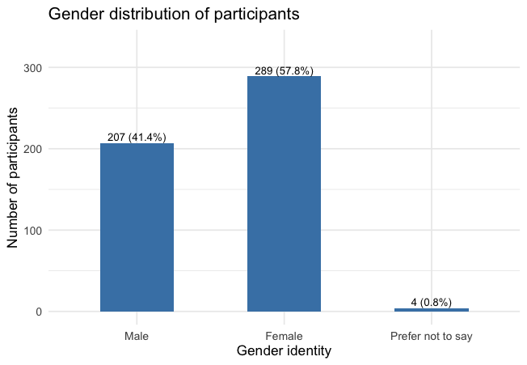
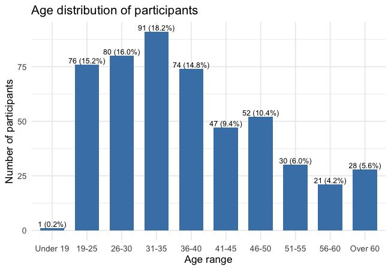
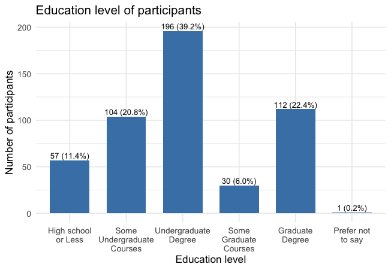
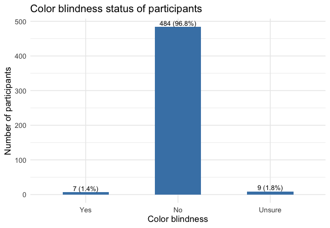
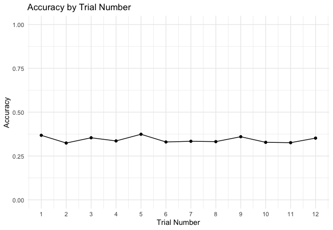
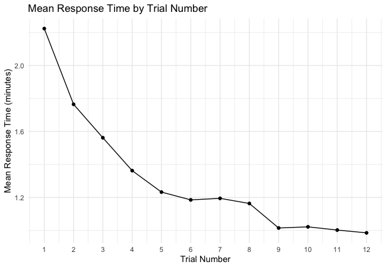
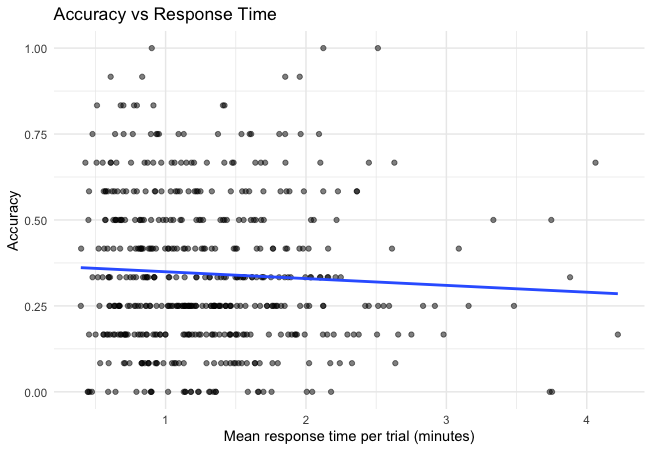
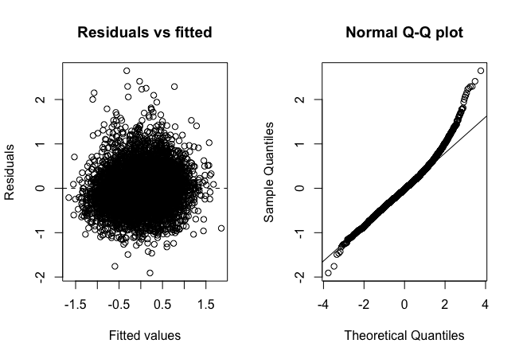

---
format:
  pdf:
    df-print: default
    fig-cap-location: bottom
    fontsize: 10pt
    geometry: margin=1in
  html: default

editor:
  markdown:
    wrap: sentence
---

# Quantitaive Analysis

## Data Summary

-   Completed participants: 500
-   Trials per participant: 12
-   Methods: Talk, Highlight, Text
-   Plot types: Box plot, Scatter plot

## 1. Participant Demographics

{#fig-gender width="55%"}

The sample consisted of 57.8% female participants and 41.4% male participants, with less than 1% preferring not to disclose their gender identity.
Thus, the participant pool was relatively balanced, although females were somewhat more represented than males.

{#fig-age width="65%"}

The participant sample included a broad range of ages, with the largest proportion of participants between 31–35 years old (18.2%).
Most participants were between 19 and 50 years of age, while relatively few participants were younger than 19 (0.2%) or older than 60 (5.6%).

{#fig-edu width="65%"}

Participants represented a range of educational backgrounds.
The largest group held an undergraduate degree (39.2%), followed by graduate degree holders (22.4%) and participants with some undergraduate coursework (20.8%).
Overall, the sample was relatively highly educated, with more than 60% of participants having completed at least an undergraduate degree.

{#fig-col width="65%"}

Most participants reported that they were not color blind (96.8%).
A small proportion reported being color blind (1.4%), while 1.8% were unsure.
Therefore, the sample was overwhelmingly composed of participants without self-reported color vision deficiencies.

## 2. Selection Accuracy and Response Times

#### Selection Accuracy
Selection accuracy was defined as the correct identification of the target plot within a lineup.
A value of 1 was assigned when the participant selected the true target plot, and a value of 0 was assigned otherwise.

### 2.1 Overall mean accuracy

| Accuracy |      SE | Lower | Upper |
|----------|--------:|------:|------:|
| 0.343    | 0.00613 | 0.331 | 0.355 |

Overall, participants correctly identified the target plot in 34.3% of trials (95% CI: 33.1%–35.5%).
This indicates that approximately one-third of lineup tasks were completed correctly across all methods and plot types.

### 2.2 Accuracy by method: Talk, Highlight, Text

|    Method | Accuracy |     SE | Lower | Upper |
|----------:|---------:|-------:|------:|------:|
| Highlight |    0.364 | 0.0108 | 0.343 | 0.385 |
|      Talk |    0.313 | 0.0104 | 0.293 | 0.333 |
|      Text |    0.353 | 0.0107 | 0.332 | 0.373 |

Selection accuracy varied across methods.
The Highlight method achieved the highest accuracy (36.4%), followed by the Text method (35.3%), while the Talk method had the lowest accuracy (31.3%).
Although differences were modest, participants appeared to perform best when using the highlighting task.

### 2.3 Accuracy by plot type: Box plot, Scatter plot

|    Plot type | Accuracy |      SE | Lower | Upper |
|-------------:|---------:|--------:|------:|------:|
|     Box plot |    0.351 | 0.00712 | 0.337 | 0.365 |
| Scatter plot |    0.319 |  0.0120 | 0.295 | 0.342 |

Participants were more accurate when evaluating box plots (35.1%) than scatter plots (31.9%).
This suggests that the target signal may have been somewhat easier to identify in box plot lineups than in scatter plot lineups.

### 2.4 Accuracy by method × plot type

| Plot type |    Method | Accuracy |     SE | Lower | Upper |
|-----------|----------:|---------:|-------:|------:|------:|
| Box plot  | Highlight |    0.379 | 0.0125 | 0.355 | 0.404 |
| Box plot  |      Talk |    0.316 | 0.0120 | 0.292 | 0.340 |
| Box plot  |      Text |    0.359 | 0.0124 | 0.334 | 0.383 |
| Scatter   | Highlight |    0.318 | 0.0208 | 0.277 | 0.359 |
| Scatter   |      Talk |    0.304 | 0.0206 | 0.264 | 0.344 |
| Scatter   |      Text |    0.334 | 0.0211 | 0.293 | 0.375 |

For box plots, the Highlight method produced the highest accuracy (37.9%), followed by Text (35.9%) and Talk (31.6%).
For scatter plots, accuracy was lower overall, with Text (33.4%) and Highlight (31.8%) showing similar performance, and Talk remaining the lowest (30.4%).
Across all methods, box plots yielded higher accuracy than scatter plots.

### 2.5 Accuracy Across Trial Sequence

{#fig-acctrial width="65%"}

Accuracy remained relatively stable throughout the 12 trials, ranging from approximately 32% to 37%.
There was no clear upward or downward trend across the trial sequence, suggesting little evidence of either a learning effect or a fatigue effect.
Participants did not appear to become substantially more accurate as they gained experience with the task, nor did their performance decline over time.
Overall, performance remained consistent across the study.

#### Response Times

### 2.6 Total Completion Time per Participant

| Mean time | Median time |   SD |  IQR |
|-----------|------------:|-----:|-----:|
| 15.7      |        14.3 | 7.51 | 9.52 |

Participants spent an average of 15.7 minutes completing all 12 trials, with a median completion time of 14.3 minutes.
Completion times varied considerably across participants (SD = 7.51 minutes), indicating substantial individual differences in task duration.

### 2.7 Response time per trial (in minutes)

| Mean time | Median time |       SD |       IQR |
|-----------|------------:|---------:|----------:|
| 1.309614  |    0.996903 | 1.131679 | 0.9965211 |

Across all trials, participants spent an average of 1.31 minutes per trial, with a median of approximately 1.00 minute.

### 2.8 Response time by method

| Method    | Mean time | Median time |   SD |   IQR |
|-----------|-----------|------------:|-----:|------:|
| Highlight | 1.02      |       0.738 | 1.02 | 0.813 |
| Talk      | 1.43      |        1.10 | 1.19 | 0.972 |
| Text      | 1.48      |        1.18 | 1.12 |  1.10 |

Response times differed across methods.
Participants completed Highlight tasks most quickly (median = 0.74 minutes), while Talk (median = 1.10 minutes) and Text (median = 1.18 minutes) required more time.
This pattern suggests that selecting and highlighting regions generally required less time than providing spoken or written explanations.

### 2.9 Response time by plot type

| Plot type    | Mean time | Median time |   SD |   IQR |
|--------------|-----------|------------:|-----:|------:|
| Box plot     | 1.31      |       0.998 | 1.16 |  1.02 |
| Scatter plot | 1.30      |       0.991 | 1.06 | 0.944 |

Response times were nearly identical for box plots and scatter plots.
Both plot types required approximately one minute per trial on average, suggesting that plot type had little impact on the time participants spent completing a task.

### 2.10 Response time by method and plot type

| Method    | Plot type    | Mean time | Median time |    SD |   IQR |
|-----------|--------------|-----------|------------:|------:|------:|
| Highlight | Box plot     | 1.02      |       0.738 |  1.04 | 0.826 |
| Highlight | Scatter plot | 1.02      |       0.739 | 0.941 | 0.783 |
| Talk      | Box plot     | 1.44      |        1.10 |  1.23 | 0.983 |
| Talk      | Scatter plot | 1.42      |        1.10 |  1.06 | 0.942 |
| Text      | Box plot     | 1.48      |        1.19 |  1.13 |  1.10 |
| Text      | Scatter plot | 1.46      |        1.15 |  1.11 |  1.06 |

The pattern of response times was consistent across plot types.
Highlight tasks were completed most quickly for both box plots and scatter plots, while Talk and Text tasks required more time.
Differences between box plots and scatter plots within a given method were minimal, indicating that method had a stronger influence on response time than plot type.

### 2.11 Response time by trial sequence

{#fig-RTtrial width="65%"}

Response time decreased steadily across the trial sequence.
Participants spent the most time on the first trial (approximately 2.2 minutes on average), after which response times declined rapidly during the first five trials and then stabilized around 1.0–1.2 minutes per trial.
This pattern suggests that participants became more familiar with the task as they progressed through the study, leading to faster completion times.

### 2.12 Relationship Between Accuracy and Response Time

{#fig-scatter width="65%"}

Participants who spent more time on the task were not consistently more accurate than those who responded more quickly.
While the fitted trend line suggests a slight negative association between response time and accuracy, the relationship appears weak, with substantial variability in accuracy observed across all response times.
Overall, spending additional time on a trial did not appear to be associated with noticeably higher performance.

## Method Agreement (Same dataset, same participant, three methods)

To examine agreement among methods, accuracy outcomes were compared for the same participant evaluating the same data set using Talk, Highlight, and Text methods.

| Interpretation                     | Percentage |
|------------------------------------|------------|
| Incorrect in all three methods     | 47.8%      |
| Correct in all three methods       | 16.8%      |
| Correct only in Highlight          | 7.6%       |
| Correct in Highlight and Text only | 7.05%      |
| Correct only in Text               | 6.25       |
| Correct in Talk and Text only      | 5.15%      |
| Correct in Talk and Highlight only | 4.75%      |
| Correct only in Talk               | 4.4%       |

The most common outcome was that all three methods failed to identify the target (47.8%), while all three methods correctly identified the targett in 16.8% of cases.

Several disagreement patterns were also observed.
Highlight-only correct responses (7.6%) occurred more frequently than Talk-only correct responses (4.4%) and slightly more frequently than Text-only correct responses (6.3%).
Additionally, Highlight and Text were jointly correct while Talk was incorrect in 7.1% of cases.
These findings suggest that the three methods do not always identify the same targets and that the Highlight method may capture information that is not always reflected in participants' verbal or written responses.

## 3. Mixed-Effects Model for Selection Accuracy

Because each participant completed multiple trials and the same datasets were evaluated repeatedly, a generalized linear mixed-effects model (GLMM) with a binomial distribution and logit link was fitted. Participant and dataset were included as random intercepts to account for repeated measurements, while method, plot type, and trial number were included as fixed effects. The reference categories were Highlight for method and Box plot for plot type.

### 3.1 Main-effects model

The initial model included the main effects of method, plot type, and trial number:

$$
\text{logit}\left[P(\text{Correct}=1)\right]
=
\beta_0
+
\beta_1(\text{Method})
+
\beta_2(\text{Plot type})
+
\beta_3(\text{Trial number})
+
u_{\text{participant}}
+
u_{\text{dataset}}.
$$

The estimated fixed effects from the main-effects model are summarized below.

| Predictor            | Estimate |    SE | z value |  p-value |
|----------------------|---------:|------:|--------:|---------:|
| Intercept            |   -1.104 | 0.248 |  -4.449 | \< 0.001 |
| Talk vs. Highlight   |   -0.379 | 0.085 |  -4.484 | \< 0.001 |
| Text vs. Highlight   |   -0.085 | 0.084 |  -1.013 |    0.311 |
| Scatter vs. Box plot |   -0.102 | 0.093 |  -1.094 |    0.274 |
| Trial number         |   -0.006 | 0.010 |  -0.626 |    0.532 |

The Talk method resulted in significantly lower accuracy than the Highlight method ($\beta=-0.379$, $p<0.001$). The odds of selecting the correct plot were approximately 31.6% lower for Talk than for Highlight (OR = 0.684).

No significant differences were observed between the Text and Highlight methods ($p=0.311$), between scatter and box plots ($p=0.274$), or across trial number ($p=0.532$).

### 3.2 Random effects

The model included random intercepts for participant and dataset.

| Random effect | Variance |    SD |
| ------------- | -------: | ----: |
| Participant   |    0.790 | 0.889 |
| Dataset       |    3.962 | 1.990 |

The random effects indicated meaningful variability among both participants and datasets. Dataset-to-dataset variability was substantially larger than participant-to-participant variability, suggesting that lineup difficulty contributed more to differences in selection accuracy than individual participant differences.

### 3.3 Method-by-plot-type interaction model

A second model was fitted to examine whether the effect of method depended on plot type.

$$
\text{logit}\left[P(\text{Correct}=1)\right]
=
\beta_0
+
\beta_1(\text{Method})
+
\beta_2(\text{Plot type})
+
\beta_3(\text{Method}*\text{Plot type})
+
\beta_4(\text{Trial number})
+
u_{\text{participant}}
+
u_{\text{dataset}}.
$$

The fixed effects from the interaction model are summarized below.

| Predictor            | Estimate |    SE | z value | p-value |
| -------------------- | -------: | ----: | ------: | ------: |
| Intercept            |   -1.061 | 0.250 |  -4.251 | < 0.001 |
| Talk vs. Highlight   |   -0.460 | 0.097 |  -4.748 | < 0.001 |
| Text vs. Highlight   |   -0.148 | 0.096 |  -1.548 |   0.122 |
| Scatter vs. Box plot |   -0.305 | 0.147 |  -2.078 |   0.038 |
| Trial number         |   -0.006 | 0.010 |  -0.576 |   0.565 |
| Talk × Scatter       |    0.345 | 0.199 |   1.736 |   0.083 |
| Text × Scatter       |    0.272 | 0.197 |   1.379 |   0.168 |

Neither interaction term was statistically significant, indicating that the effect of method did not differ between box plots and scatter plots.

### 3.4 Model comparison

The two models were compared to determine whether including the method-by-plot-type interaction improved model fit.

| Model              |    AIC |    BIC |
| ------------------ | -----: | -----: |
| Main-effects model | 5670.1 | 5717.0 |
| Interaction model  | 5670.9 | 5731.2 |

The main-effects model had a slightly lower AIC than the interaction model.
In addition, neither interaction term was statistically significant.

Therefore, the interaction model did not provide clear evidence that the relationship between method and accuracy differed by plot type.
The simpler main-effects model was retained as the primary model because it provided a more parsimonious explanation of the data.

### 3.5 Summary of accuracy model results

The mixed-effects analysis showed that method was associated with selection accuracy after accounting for repeated measurements and differences among participants and datasets.

The Talk method produced significantly lower accuracy than the Highlight method.
The Text and Highlight methods did not differ significantly.

There was no overall evidence in the main-effects model that accuracy differed between box plots and scatter plots.
There was also no evidence that accuracy systematically increased or decreased across the trial sequence.

Participant and dataset random effects indicated meaningful heterogeneity in performance.
In particular, dataset-to-dataset variability was larger than participant-to-participant variability, suggesting that lineup difficulty was an important source of variation in selection accuracy.

## 4. Mixed-Effects Model for Response Time

Because response times were positive and right-skewed, response time in minutes was log-transformed before analysis. Linear mixed-effects models were fitted with participant and dataset as random intercepts and method, plot type, and trial number as fixed effects. The reference categories were Highlight for method and Box plot for plot type.

### 4.1 Main-effects model

The main-effects model was:

$$
\log(\text{Response time})
=
\beta_0
+
\beta_1(\text{Method})
+
\beta_2(\text{Plot type})
+
\beta_3(\text{Trial number})
+
u_{\text{participant}}
+
u_{\text{dataset}}.
$$

The fixed effects from the main-effects model are summarized below.

| Predictor            | Estimate |    SE | t value | p-value |
| -------------------- | -------: | ----: | ------: | ------: |
| Intercept            |    0.168 | 0.027 |   6.308 | < 0.001 |
| Talk vs. Highlight   |    0.419 | 0.015 |  27.931 | < 0.001 |
| Text vs. Highlight   |    0.449 | 0.015 |  29.945 | < 0.001 |
| Scatter vs. Box plot |    0.012 | 0.015 |   0.802 |   0.422 |
| Trial number         |   -0.070 | 0.002 | -39.272 | < 0.001 |

Because the outcome was log-transformed, the coefficients were exponentiated to obtain time ratios.

| Comparison                        | Time ratio | Percentage change |
| --------------------------------- | ---------: | ----------------: |
| Talk vs. Highlight                |      1.520 |      52.0% longer |
| Text vs. Highlight                |      1.566 |      56.6% longer |
| Scatter vs. Box plot              |      1.012 |       1.2% longer |
| One-unit increase in trial number |      0.933 |      6.7% shorter |

Response times were significantly longer for Talk and Text than for Highlight. After back-transformation, estimated response times were approximately 52.0% longer for Talk and 56.6% longer for Text relative to Highlight.

Plot type was not significantly associated with response time ($p=0.422$). Trial number had a significant negative effect ($p<0.001$), with each additional trial associated with an estimated 6.7% reduction in response time. This provides strong evidence that participants became faster as they progressed through the study.

### 4.2 Random effects

| Random effect | Variance |    SD |
| ------------- | -------: | ----: |
| Participant   |    0.182 | 0.426 |
| Dataset       |    0.006 | 0.077 |
| Residual      |    0.224 | 0.474 |

There was substantial participant-level variability in log response time, indicating that some participants consistently completed the trials more quickly than others.

Dataset-level variability was relatively small. This suggests that differences among participants were more important for response time than differences among datasets.

This pattern differs from the accuracy model, where dataset-level heterogeneity was larger than participant-level heterogeneity. For response time, individual differences among participants were the more important source of random variation.

### 4.3 Method-by-plot-type interaction model

A second model was fitted to examine whether the relationship between method and response time differed by plot type.

$$
\log(\text{Response time})
=
\beta_0
+
\beta_1(\text{Method})
+
\beta_2(\text{Plot type})
+
\beta_3(\text{Method * Plot type})
+
\beta_4(\text{Trial number})
+
u_{\text{participant}}
+
u_{\text{dataset}}.
$$
The fixed effects from the interaction model are summarized below.

| Predictor            | Estimate |    SE | t value | p-value |
| -------------------- | -------: | ----: | ------: | ------: |
| Intercept            |    0.163 | 0.027 |   6.030 | < 0.001 |
| Talk vs. Highlight   |    0.420 | 0.017 |  24.289 | < 0.001 |
| Text vs. Highlight   |    0.463 | 0.017 |  26.740 | < 0.001 |
| Scatter vs. Box plot |    0.033 | 0.025 |   1.306 |   0.192 |
| Trial number         |   -0.070 | 0.002 | -39.310 | < 0.001 |
| Talk × Scatter       |   -0.006 | 0.035 |  -0.187 |   0.852 |
| Text × Scatter       |   -0.055 | 0.035 |  -1.598 |   0.110 |

Neither interaction term was statistically significant, indicating that the effect of method on response time did not differ by plot type.

The interaction model also had slightly higher AIC and BIC values than the main-effects model. Therefore, adding the method-by-plot-type interaction did not provide clear improvement in model fit.

The simpler main-effects model was retained as the primary response-time model.

### 4.4 Pairwise comparisons

Because the main-effects model was selected, it was refitted using restricted maximum likelihood (REML) before estimating the final model coefficients and conducting Tukey-adjusted pairwise comparisons.

| Comparison       | Estimate | 95% CI           | p-value |
| ---------------- | -------: | ---------------- | ------- |
| Highlight – Talk |   -0.419 | [-0.454, -0.383] | <0.001  |
| Highlight – Text |   -0.449 | [-0.484, -0.414] | <0.001  |
| Talk – Text      |   -0.030 | [-0.065, 0.005]  | 0.109   |

The pairwise comparisons confirmed that the Highlight method required significantly less time than both the Talk and Text methods.

There was no statistically significant difference in response time between the Talk and Text methods after adjusting for multiple comparisons (p = 0.109).

Thus, Highlight had significantly shorter response times than both Talk and Text.

### 4.5 Model-adjusted response times

The estimated marginal means were back-transformed to obtain model-adjusted response times on the original minute scale.

| Method    | Estimated response time (min) | 95% CI         |
| --------- | ----------------------------: | -------------- |
| Highlight |                         0.757 | [0.722, 0.793] |
| Talk      |                         1.150 | [1.097, 1.205] |
| Text      |                         1.185 | [1.131, 1.242] |

After adjusting for plot type, trial number, participant, and dataset, Highlight had the shortest estimated response time.

### 4.6 Model diagnostics

{#fig-age width="65%"}

Visual inspection of the residual-versus-fitted plot indicated no obvious trend or systematic change in residual variance, suggesting that the assumptions of linearity and homoscedasticity were reasonably satisfied.

The normal Q–Q plot showed that residuals followed the theoretical normal distribution reasonably well, although slight departures were observed in the upper tail. Given the large sample size (6000 observations), these deviations were not considered sufficiently severe to invalidate the model.

The singularity diagnostic returned `FALSE`, suggesting that the random-effects structure was adequately supported by the data.

### 4.7 Summary of response-time model results

The mixed-effects analyses showed that the Highlight method achieved significantly shorter response times than either the Talk or Text methods while maintaining comparable or better accuracy. Although participants became substantially faster over successive trials, there was no corresponding improvement in accuracy, suggesting increased familiarity with the experimental procedure rather than improved task performance. There was also no evidence that the relative performance of the methods depended on plot type.

Together with the accuracy analysis presented in Section 3, these results suggest that the Highlight method provides both high selection accuracy and lower completion times relative to the Talk and Text methods.

## 5. Relationship Between Response Time and Accuracy

Because response time varied both between participants and across trials completed by the same participant, log response time was decomposed into between-participant and within-participant components.

The between-participant component represented each participant’s average log response time across all trials. The within-participant component represented the difference between a trial’s log response time and that participant’s average.

A generalized linear mixed-effects model was fitted:

$$
\begin{aligned}
\text{logit}\left[P(\text{Correct}=1)\right]
={}&
\beta_0
+
\beta_1(\text{Participant mean RT})
+
\beta_2(\text{Within-participant RT}) \\
&+
\beta_3(\text{Method})
+
\beta_4(\text{Plot type})
+
\beta_5(\text{Trial number})
+
u_{\text{participant}}
+
u_{\text{dataset}}.
\end{aligned}
$$

The fixed effects are summarized below.

| Predictor                        | Estimate |    SE |      z | p-value | Odds Ratio |
| -------------------------------- | -------: | ----: | -----: | ------: | ---------: |
| Participant mean response time   |    0.011 | 0.119 |  0.090 |   0.928 |       1.01 |
| Within-participant response time |   -0.304 | 0.078 | -3.890 |  <0.001 |       0.74 |
| Talk vs Highlight                |   -0.256 | 0.090 | -2.838 |   0.004 |       0.77 |
| Text vs Highlight                |    0.048 | 0.090 |  0.527 |   0.598 |       1.05 |
| Scatter vs Box                   |   -0.097 | 0.093 | -1.048 |   0.295 |       0.91 |
| Trial number                     |   -0.027 | 0.011 | -2.369 |   0.018 |       0.97 |

There was no evidence that participants who were generally slower throughout the experiment were more or less accurate than participants who were generally faster (β = 0.011, p = 0.928).

However, response time within participants was significantly associated with accuracy. When participants spent longer than their own average response time on a trial, they had significantly lower odds of selecting the correct plot (β = -0.304, p < 0.001; OR = 0.74, 95% CI [0.63, 0.86]). This suggests that unusually long response times reflected increased task difficulty or participant uncertainty rather than more careful processing leading to improved performance.

After adjusting for response time, the Talk method remained significantly less accurate than Highlight ($\beta=-0.256$, $p=0.004$). Text did not differ significantly from Highlight, and plot type was not significantly associated with accuracy(p = 0.295).

Trial number had a small negative association with accuracy ($\beta=-0.027$, $p=0.018$), indicating a modest decline in accuracy across successive trials after accounting for response time and the other model terms.

Overall, participants who were generally slower were not less accurate. Instead, lower accuracy was associated specifically with trials on which participants took longer than their own usual response time.

### Next Step??

**Qualitative analysis:** Analyze the talk-aloud transcripts, highlighted regions, and text summaries.